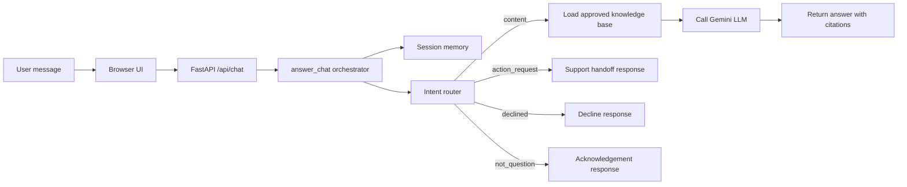

# Gen Academy FAQ Bot POC

A web-based FAQ bot for Gen Academy cohort-content questions. It answers only from
the local approved knowledge base and returns a clear unavailable response when the
answer is not present.

## Agent architecture diagram

The FAQ bot follows a lightweight agent-style flow built around a controller, a routing decision layer, session memory, and an LLM generation step.

1. User input arrives from the browser UI and is sent to the FastAPI endpoint in `app/main.py`.
2. The request is handled by `app/answering.py`, which acts as the main orchestration layer.
3. The message is classified into one of four routes: `content`, `action_request`, `declined`, or `not_question`.
4. Session memory is loaded from `app/session_memory.py` so follow-up questions can stay in context.
5. For content questions, the approved knowledge base is loaded from `app/knowledge.py` and passed to the Gemini model in `app/llm.py`.
6. The final answer is cleaned, stored in session history, and returned to the user.



The flow above maps directly to the core modules in the repository: `app/main.py` for the HTTP entrypoint, `app/answering.py` for routing and orchestration, `app/session_memory.py` for follow-up state, `app/knowledge.py` for the approved content source, and `app/llm.py` for the language model integration.

## What It Does

- Serves a browser chat UI at `/`.
- Exposes `POST /api/chat` for the web UI.
- Passes the complete approved knowledge base document to Gemini on every content question.
- Includes source citations in every factual answer.
- Keeps short follow-up context during the active in-memory session.
- Refuses career/job-transition coaching questions.
- Returns the fallback text when the KB does not contain the answer:
  `I couldn't find this information in the current course material.`

## Setup

```powershell
python -m venv .venv
.\.venv\Scripts\python.exe -m pip install -r requirements.txt
Copy-Item .env.example .env
```

Fill in `GEMINI_API_KEY` in `.env`.

## Run

```powershell
.\.venv\Scripts\python.exe -m uvicorn app.main:app --reload --port 8000
```

Open `http://127.0.0.1:8000`.

## API Example

```powershell
Invoke-RestMethod `
  -Method Post `
  -Uri http://127.0.0.1:8000/api/chat `
  -ContentType application/json `
  -Body '{"message":"Where was chunking discussed?","student_identity":"web-demo"}'
```

## Knowledge Base

Set `KNOWLEDGE_BASE_PATH` to the single approved knowledge base document. The default is
`knowledge_base/cohort_questions_full_list_with_resources.md`, extracted from
`Cohort_Questions_Full_List_With_Resources (1).docx`. The app sends that full document to
the LLM for every content question.

The repository also includes the full question-to-resource mapping dataset in
[knowledge_base/cohort_questions_full_list_with_resources.md](knowledge_base/cohort_questions_full_list_with_resources.md).

Approved sources

- See [APPROVED_SOURCES.md](APPROVED_SOURCES.md) for the single approved knowledge source and rules the LLM must follow when answering course-content questions.

This POC intentionally does not use document chunking, embeddings, vector databases, semantic
search, Pinecone, FAISS, ChromaDB, or a RAG pipeline.
