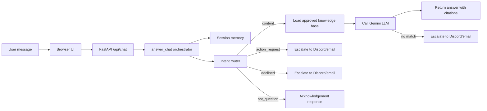

# Gen Academy FAQ Bot POC

A web-based FAQ bot for Gen Academy cohort-content questions. It answers course-mechanics
questions from a generic local FAQ knowledge base, and escalates career/job-transition and
account/billing/access/scoring questions to program staff via Discord and email.

## Agent architecture diagram

The FAQ bot follows a lightweight agent-style flow built around a controller, a routing decision layer, session memory, and an LLM generation step.

1. User input arrives from the browser UI and is sent to the FastAPI endpoint in `app/main.py`.
2. The request is handled by `app/answering.py`, which acts as the main orchestration layer.
3. The message is classified into one of four routes: `content`, `action_request`, `declined`, or `not_question`.
4. Session memory is loaded from `app/session_memory.py` so follow-up questions can stay in context.
5. For content questions, the approved knowledge base is loaded from `app/knowledge.py` and passed to the Gemini model in `app/llm.py`.
6. `action_request` and `declined` questions, plus unanswered content questions, are escalated to staff via `app/escalation.py`.
7. The final answer is cleaned, stored in session history, and returned to the user.



The flow above maps directly to the core modules in the repository: `app/main.py` for the HTTP entrypoint, `app/answering.py` for routing and orchestration, `app/session_memory.py` for follow-up state, `app/knowledge.py` for the approved content source, `app/llm.py` for the language model integration, and `app/escalation.py` (with `app/integrations/discord.py` and `app/integrations/email.py`) for staff escalation.

## What It Does

- Serves a browser chat UI at `/`.
- Exposes `POST /api/chat` for the web UI.
- Passes the complete approved knowledge base document to Gemini on every content question.
- Includes source citations in every factual answer.
- Keeps short follow-up context during the active in-memory session.
- Escalates career/job-transition questions, and account/billing/access/scoring/credit/submission
  requests, to program staff over Discord webhook and email instead of answering them.
- Escalates content questions the knowledge base can't answer, returning the fallback text:
  `I couldn't find this information in the current course material.`
- Students only ever interact through the web chat; Discord/email are one-way staff notifications,
  not a channel students can post to.

## Setup

```powershell
python -m venv .venv
.\.venv\Scripts\python.exe -m pip install -r requirements.txt
Copy-Item .env.example .env
```

Fill in `GEMINI_API_KEY` in `.env`. Optionally fill in the escalation settings if you want Discord/email
notifications delivered:

- `DISCORD_WEBHOOK_URL`
- `ESCALATION_EMAIL_TO`
- `SMTP_HOST`
- `SMTP_PORT`
- `SMTP_USER`
- `SMTP_PASSWORD`
- `EMAIL_FROM`

The app still runs without these values; escalation attempts are simply skipped.

## Run

```powershell
.\.venv\Scripts\python.exe -m uvicorn app.main:app --reload --port 8000
```

Open `http://127.0.0.1:8000`.

## API Example

```powershell
Invoke-RestMethod `
  -Method Post `
  -Uri http://127.0.0.1:8000/api/chat `
  -ContentType application/json `
  -Body '{"message":"Where was chunking discussed?","student_identity":"web-demo"}'
```

## Knowledge Base

Set `KNOWLEDGE_BASE_PATH` to the single approved knowledge base document. The default is
[knowledge_base/gen_academy_faq.md](knowledge_base/gen_academy_faq.md), a generic,
de-identified set of question-and-answer entries covering recurring course-mechanics questions
(recordings/resources, logistics/scheduling, project submission, technical/course mechanics, and
the certification process). The app sends that full document to the LLM for every content
question; the LLM (see `SYSTEM_PROMPT` in `app/llm.py`) is instructed to answer only from it.

Career/job-transition questions and account/billing/access/scoring/credit/submission requests are
never sent to the LLM — `app/answering.py` routes them straight to staff escalation instead.

This POC intentionally does not use document chunking, embeddings, vector databases, semantic
search, Pinecone, FAISS, ChromaDB, or a RAG pipeline.
